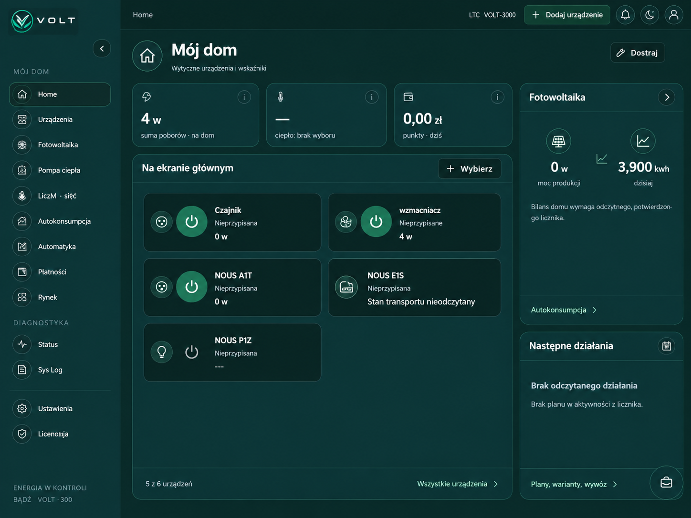
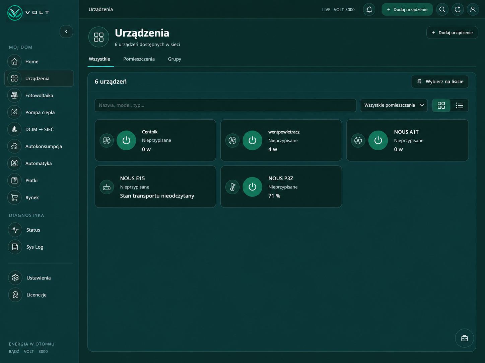
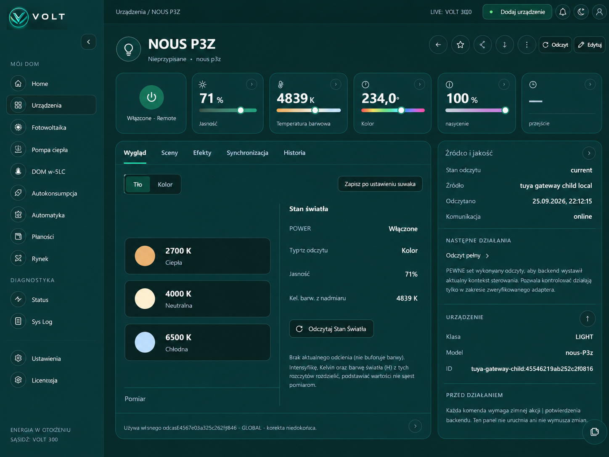
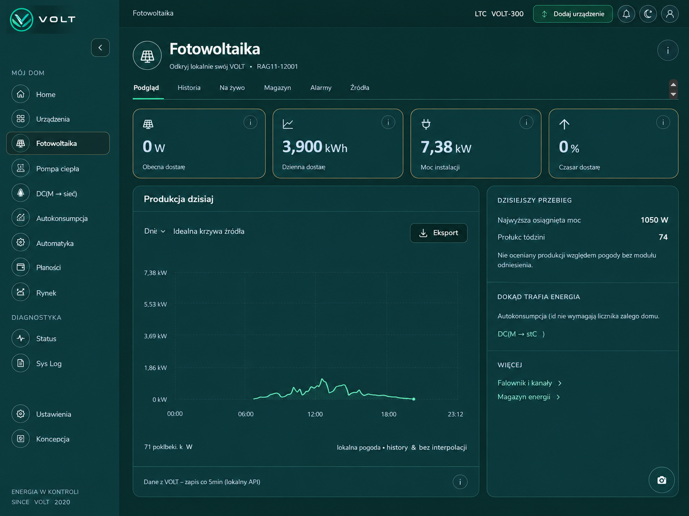
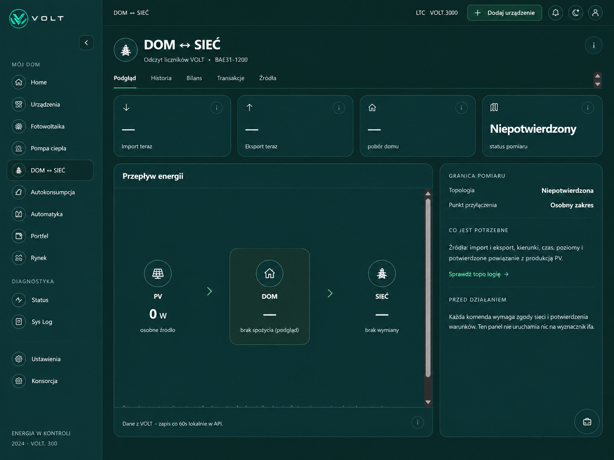
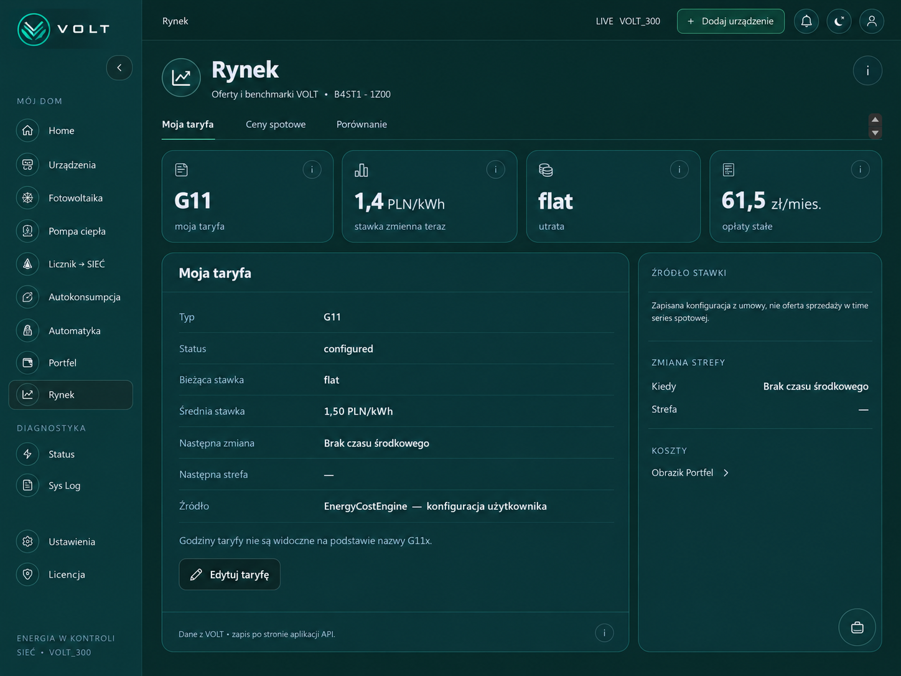
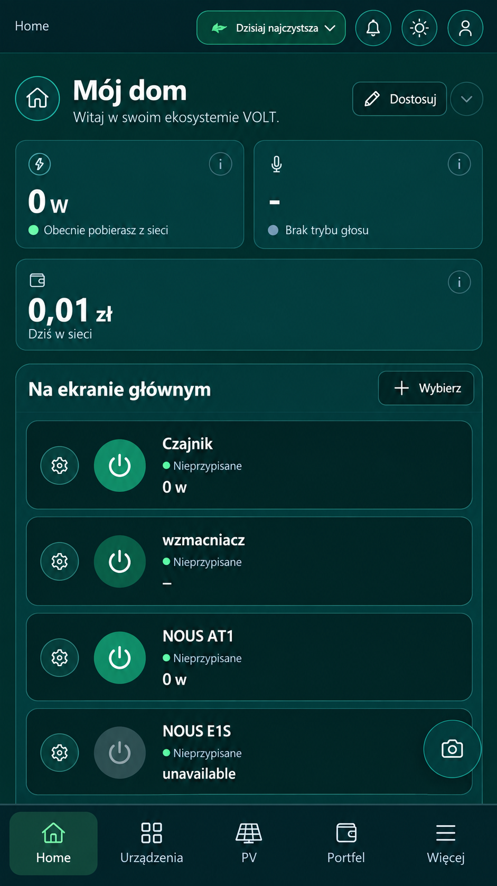
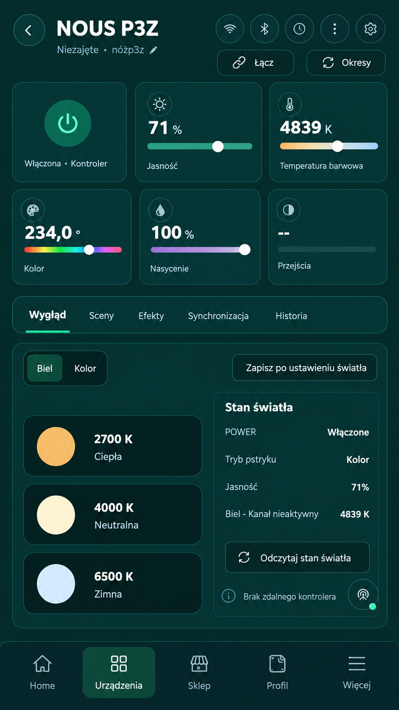

  

# VOLT

**Local energy management for the home**

**Project website:** [volt-os.web.app](https://volt-os.web.app/)

VOLT is a developing system that brings together information from solar power, heating, the electricity grid and household devices.

The goal is to give the user one clear view of what is happening with energy across the whole home: how much is being produced, how much is being used, what grid electricity costs and when energy can be used more effectively.

## Update: one interface and control of real devices

The public update dated 28 September 2026 presents a shared desktop/mobile
interface and readings and control for selected real devices: plugs, lighting
and devices connected through a gateway. Communication paths being tested
include Tasmota, Matter and Zigbee.

We are developing the “Add to VOLT” process, device-state confirmation and
resilience to delayed readings. Next steps include simpler device onboarding,
more verified integrations and connecting further parts of the home.

## What VOLT does

- collects available data from different devices and services,
- organises that data so it can be analysed together,
- shows production, consumption and cost in one place,
- helps identify when solar energy can be used more effectively,
- supports automatic actions only where a device can be controlled safely and predictably,
- works locally wherever practical and uses a manufacturer service only when a specific device requires it.

## Why VOLT exists

Home energy systems usually work separately. Solar has one application, heating another, household devices another, while energy and cost data may be available somewhere else again.

VOLT is being built to bring these pieces together without making the whole system dependent on equipment from a single manufacturer.

## How the project is developed

VOLT is tested with real devices and a real residential energy installation.

The basic rule is simple: the system should show only what it actually knows. Missing data is not treated as zero, and control functions are enabled only when a specific device can perform them safely and predictably.

Current work includes:

- household devices and their energy use,
- solar production and available surplus energy,
- heating and heat-pump integration,
- electricity import and export balance,
- tariffs and actual energy cost,
- automatic decisions about how energy should be used.

## Selected screens

This gallery matches the images published on the [VOLT website](https://volt-os.web.app/#aktualnosci).
It was synchronised on 8 October 2026 with the public update dated 28 September 2026.

### Desktop

#### Home — household energy and selected devices

#### Devices — one view of devices in the system

#### LIGHT / P3Z — local readings and lamp control

#### Solar — production, history and installation status

#### HOME ↔ GRID — energy flow and explicit measurement status

#### Market — tariff, price and energy costs

### Mobile

#### Home — the same application on a phone

#### LIGHT / P3Z — lamp control and readings on a phone

## Project status

VOLT is under active development and has not yet reached full production deployment. Individual parts are added and verified step by step using real equipment.

A simplified project status is available in [PROJECT_STATUS.md](PROJECT_STATUS.md).

The near-term development plan is available in [ROADMAP.md](ROADMAP.md).

## Cooperation

We are interested in working with:

- energy and smart-home equipment manufacturers,
- solar and heat-pump installers,
- companies interested in pilot deployments,
- technology partners,
- investors and programmes supporting new energy solutions.

We are particularly interested in device testing opportunities, access to integration documentation and real installations where further parts of the system can be verified.

**Website:** [volt-os.web.app](https://volt-os.web.app/)

## Source code

This repository is intended as a public presentation of the project. The main VOLT source code remains private.

---

**VOLT — an independently developed energy management system.**

[Polska wersja](README.md)